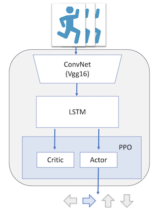

A Novel Approach to Active Vision: Integrating Attention-based Predictive Learning with Reinforcement Learning
===

# Introduction
**This project encompasses two models. The first model integrates a CNN-LSTM neural network with the PPO (Proximal Policy Optimization) algorithm, demonstrating exceptional performance in target tracking tasks. The second model, which is still under development, aims to achieve state-of-the-art performance by integrating attention-based predictive learning with reinforcement learning.**

# Model 1 -- CNN-LSTM + PPO
## Architecture
**The first model integrates a CNN-LSTM neural network with the PPO (Proximal Policy Optimization) algorithm, demonstrating exceptional performance in target tracking tasks.**

## Environment
We used the gym-unrealcv 3D environments for tracking tasks developed by Fangwei Zhong.

The **3D environments** are built on Unreal Engine(UE4), which could be flexibly customized to simulate real-world active tracking scenarios.
To run the 3D environments, GPU is necessary.

**Here is the repo containing the the instructions to install and use the 3D environments
[gym-unrealcv](https://github.com/zfw1226/gym-unrealcv).**

## Hyperparameters
* Each stack of frames contains the current and last two previous observations. 

* The size of memory buffer for PPO, i.e. one epoch, is 100 steps. 

* Both the policy learning rate and value function learning rate are 1e-4. 

* The training iterations of both policy and value functions during memory recall process are 80. 

* The clip ratio is 0.2 and the value of gamma is 0.9. The target kl value is 0.01 while the lam value is 0.97. 

* The environment seed is set to 0.

## Results
**Here is training results in terms of the reward of each epoch**

**Here is training results in terms of the reward of every 50 epoches**

## Demo
**Here is a demo of the tracking performance of the model for the first 20 epoches.**

